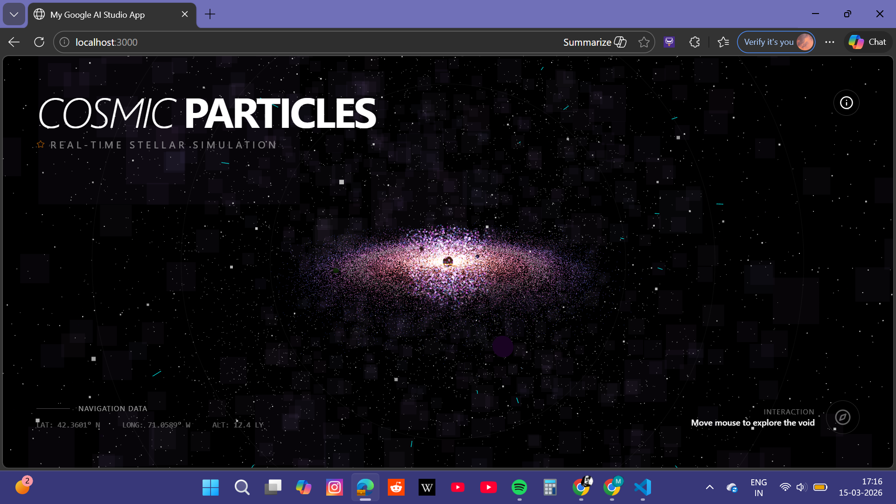
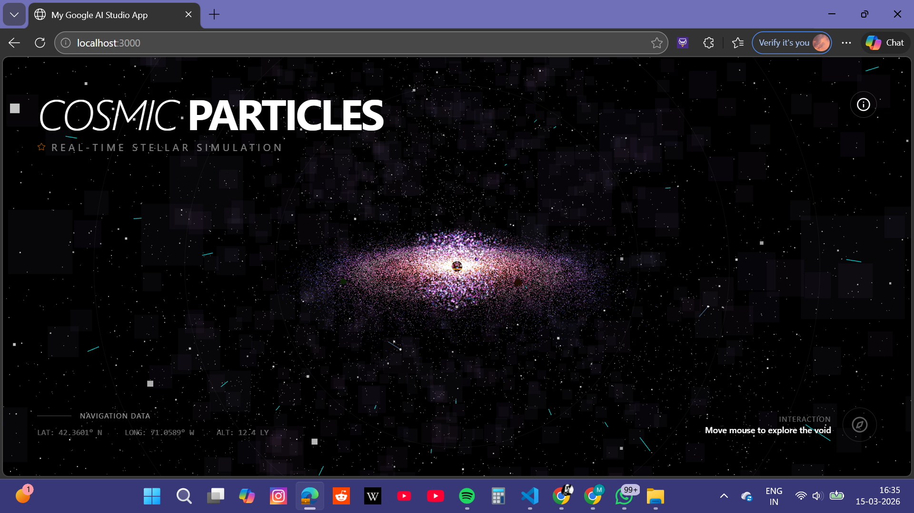
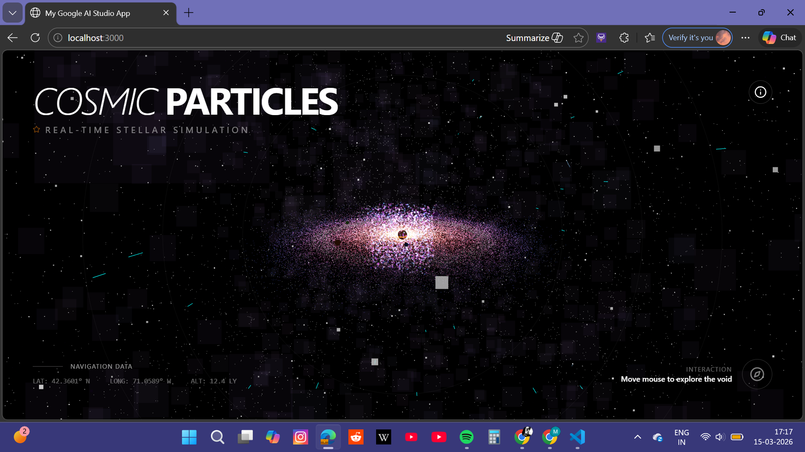

# 🌌 Cosmic Particles Visualization

An interactive **cosmic particle simulation** built with modern web technologies.  
This project visualizes a **3D universe-like particle system** where thousands of particles move dynamically to simulate cosmic motion.

It demonstrates **real-time rendering, modern frontend architecture, and WebGL-based visualization** using React and Three.js.

---

# ✨ Features

## 🌠 Interactive Cosmic Particle System
- Renders thousands of particles in a dynamic 3D space.
- Creates a **cosmic / galaxy-like visual effect**.
- Smooth animation and fluid particle movement.

## ⚡ High Performance Rendering
- Powered by **WebGL** through Three.js.
- Efficient rendering of large particle sets.

## 🧩 Modular Architecture
- Clean component-based structure.
- Easily extendable for additional features.

## 🎨 Modern UI
- Built with **TailwindCSS** for fast styling.
- Minimal and responsive design.

## 🧠 AI Ready
Architecture prepared for future integration with AI models such as:
- Gemini
- OpenAI
- Generative particle systems

---

# 🛠 Tech Stack

| Technology | Purpose |
|------------|---------|
| React | UI framework |
| Vite | Fast build tool |
| TypeScript | Type-safe development |
| Three.js | 3D graphics rendering |
| WebGL | GPU accelerated graphics |
| TailwindCSS | Styling framework |

---

# 📂 Project Structure

```
cosmic-particles-visualization
│
├── src
│   ├── components
│   │   └── SpaceScene.tsx
│   │
│   ├── App.tsx
│   ├── main.tsx
│   └── index.css
│
├── index.html
├── package.json
├── tsconfig.json
├── vite.config.ts
├── metadata.json
├── .env.example
└── README.md
```

---

# 🚀 Installation

### Clone the repository

```bash
git clone https://github.com/tanishipss/cosmic-particles-visualization.git
```

Navigate into the folder

```bash
cd cosmic-particles-visualization
```

---

### Install dependencies

```bash
npm install
```

---

### Run the development server

```bash
npm run dev
```

The application will start at:

```
http://localhost:3000
```

---

# ⚙️ Environment Variables

Create a `.env` file in the root directory.

Example:

```
VITE_GEMINI_API_KEY=your_api_key_here
VITE_APP_URL=http://localhost:3000
```

---
# 📸 Demo

## Landing Page


## Cosmic Particle Simulation


## Detailed View



```

---

# 🧪 Future Improvements

Possible enhancements for this project:

- AI-generated particle universes
- Mouse interaction with particle fields
- Audio-reactive particle visualization
- AI-driven galaxy generation
- Neural network visualization
- Interactive simulation controls

---

# 🎯 Learning Objectives

This project demonstrates:

- Real-time 3D rendering in web applications
- React + Three.js integration
- WebGL graphics programming
- Modern frontend development workflow
- Interactive visual simulations

---

# 👩‍💻 Author

**Tanisha Yadav**

GitHub:  
https://github.com/tanishipss

---

# ⭐ Support

If you like this project, consider giving it a **star ⭐ on GitHub**.

